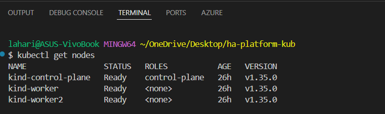
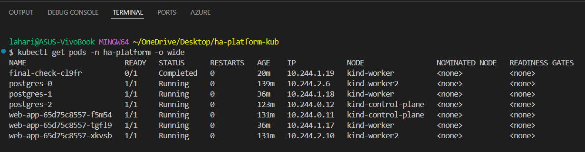
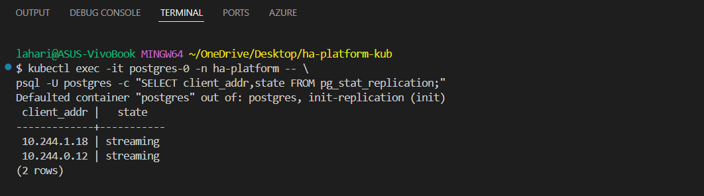
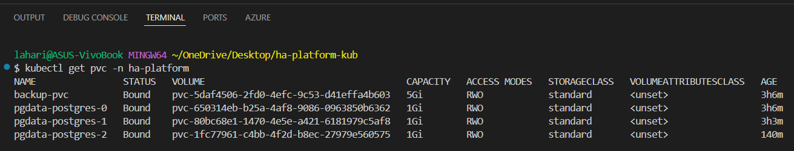
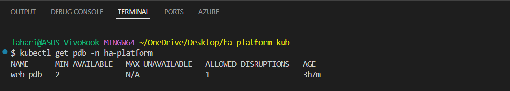
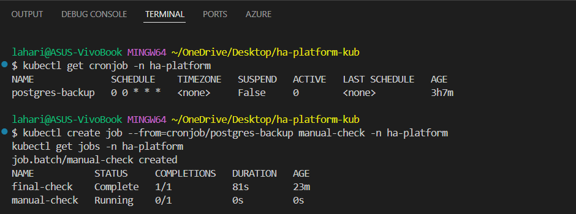
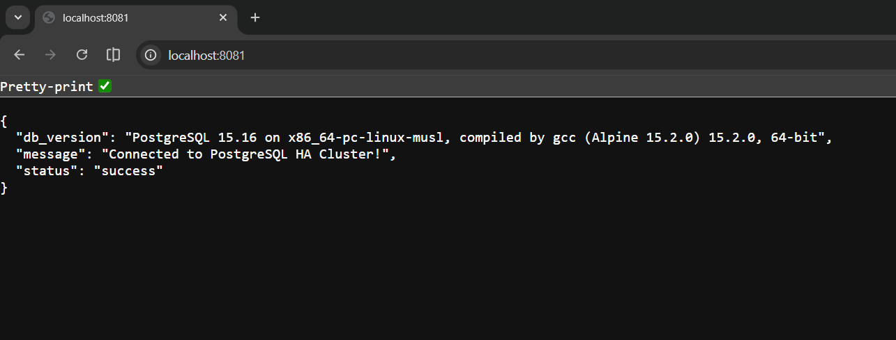
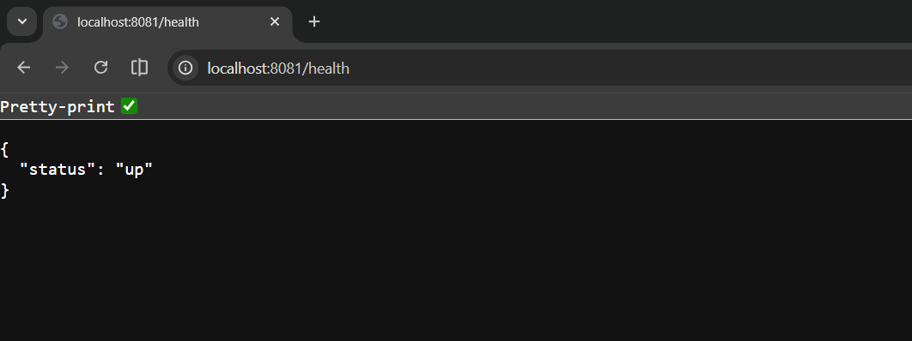
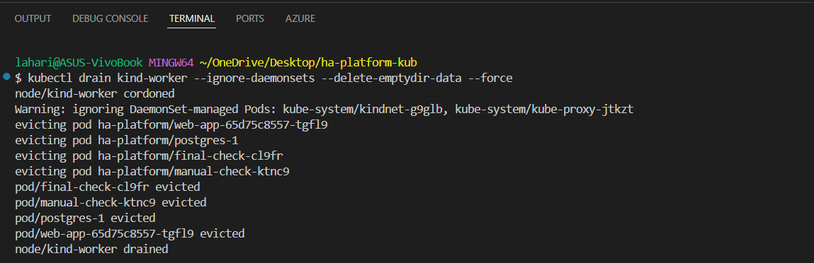

# Architect Highly Available Stateful Platform on Kubernetes

## Project Overview

This project demonstrates a production-grade Highly Available platform deployed on Kubernetes.

The system consists of:

- Stateless Web Application (3 replicas)
- PostgreSQL StatefulSet (1 Primary + 2 Standbys)
- Streaming Replication
- Persistent Storage using PVCs
- PodDisruptionBudgets
- Rolling Updates (Zero Downtime)
- Automated Daily Backups using CronJob

The platform ensures business continuity during failures and traffic spikes.

---

# Architecture Overview

Users  
│  
▼  
Web Service (NodePort)  
│  
▼  
Web Deployment (3 replicas + anti-affinity)  
│  
▼  
PostgreSQL Headless Service  
│  
▼  
postgres-0 (Primary)  
postgres-1 (Standby)  
postgres-2 (Standby)  
│  
▼  
Persistent Volume Claims (1Gi each)  
│  
▼  
Backup CronJob (pg_dump daily)

---

# Prerequisites

Ensure the following tools are installed:

- Docker Desktop (or Kind / Minikube)
- kubectl
- Git

Verify Kubernetes is running:

```bash
kubectl cluster-info
```

---

# Project Structure

```
ha-platform-kub/
│
├── README.md
├── Dockerfile
├── docker-compose.yml
│
├── src/
│   ├── app.js
│   ├── package.json
│
└── k8s/
    ├── namespace.yaml
    ├── postgres-service.yaml
    ├── postgres-statefulset.yaml
    ├── postgres-pdb.yaml
    ├── web-deployment.yaml
    ├── web-service.yaml
    ├── web-pdb.yaml
    ├── backup-cronjob.yaml
```

---

# Step-by-Step Deployment Guide

## Step 1: Create Namespace

```bash
kubectl apply -f k8s/namespace.yaml
kubectl get namespaces
```

---

## Step 2: Deploy PostgreSQL StatefulSet

```bash
kubectl apply -f k8s/postgres-service.yaml
kubectl apply -f k8s/postgres-statefulset.yaml
kubectl apply -f k8s/postgres-pdb.yaml
```

Verify:

```bash
kubectl get pods -n ha-platform
kubectl get statefulset -n ha-platform
kubectl get pvc -n ha-platform
```

Expected:
- postgres-0 Running
- postgres-1 Running
- postgres-2 Running
- PVCs Bound (1Gi each)

---

## Step 3: Enable Streaming Replication (One-Time Setup)

Allow replication connections:

```bash
kubectl exec -it postgres-0 -n ha-platform -- bash
echo "host replication postgres 0.0.0.0/0 md5" >> /var/lib/postgiesql/data/pg_hba.conf
exit
kubectl delete pod postgres-0 -n ha-platform
```

Verify replication:

```bash
kubectl exec -it postgres-0 -n ha-platform -- \
psql -U postgres -c "SELECT client_addr,state FROM pg_stat_replication;"
```

Expected:
Two rows with state = streaming.

Check replica mode:

```bash
kubectl exec -it postgres-1 -n ha-platform -- \
psql -U postgres -c "SELECT pg_is_in_recovery();"
```

Expected output:
t

---

## Step 4: Deploy Web Application

```bash
kubectl apply -f k8s/web-deployment.yaml
kubectl apply -f k8s/web-service.yaml
kubectl apply -f k8s/web-pdb.yaml
```

Verify:

```bash
kubectl get pods -n ha-platform
kubectl get deployment -n ha-platform
```

Expected:
3 web pods Running.

---

## Step 5: Deploy Backup CronJob

```bash
kubectl apply -f k8s/backup-cronjob.yaml
```

Verify:

```bash
kubectl get cronjob -n ha-platform
```

Test manually:

```bash
kubectl create job --from=cronjob/postgres-backup manual-backup -n ha-platform
kubectl get jobs -n ha-platform
```

Expected:
manual-backup Complete 1/1

---

#  Verification Screenshots

## 🔹 Cluster Setup


## 🔹 High Availability (Pod Distribution)


## 🔹 PostgreSQL Streaming Replication


## 🔹 Persistent Storage


## 🔹 Pod Disruption Budget


## 🔹 Backup CronJob


## 🔹 Manual Backup Success


## 🔹 Application Running


## 🔹 Health Endpoint


## 🔹 Node Drain Eviction


## 🔹 Post Drain Rescheduling

---

# Resilience Testing

Simulate node disruption:

```bash
kubectl drain <node-name> --ignore-daemonsets --delete-emptydir-data
```

Observe:
- Pods rescheduled automatically
- Replication maintained
- No data loss

Re-enable node:

```bash
kubectl uncordon <node-name>
```

---

# Docker Compose Verification

To verify application logic independently:

```bash
docker-compose up --build
```

This ensures:
- Web connects to database
- Schema initializes
- Application serves traffic

---

# Production Features Implemented

- StatefulSet for PostgreSQL
- VolumeClaimTemplates (1Gi per replica)
- Streaming Replication
- PodDisruptionBudgets
- Rolling Updates
- Liveness & Readiness Probes
- Pod Anti-Affinity
- Automated Backups via CronJob
- Persistent Storage

---

# Expected Outcomes Achieved

- Database redundancy (1 Primary + 2 Standbys)
- Zero downtime deployments
- Data persistence across restarts
- Automatic failover recovery
- Scheduled daily backups

---

# Conclusion

This project demonstrates the design and deployment of a highly available, production-grade stateful platform on Kubernetes using best practices for:

- Reliability
- Data durability
- High availability
- Disaster recovery

The system successfully maintains business continuity under failure scenarios.

---

# Author

Name: Lahari Sri  
Project: Architect Highly Available Stateful Platform on Kubernetes