# Highly Available Stateful Platform on Kubernetes

## What This Project Does

This is a Kubernetes-based platform built for high availability. It runs a web app backed by a PostgreSQL database that stays up even when nodes go down. Here's what's included:

- Web app with 3 replicas spread across different nodes
- PostgreSQL with 1 primary and 2 standbys doing streaming replication
- Each database pod gets its own persistent volume (1Gi)
- PodDisruptionBudgets so at least 2 pods are always running
- NetworkPolicy so only the web app and backup job can talk to the database
- Rolling updates that never take the app fully down
- A daily backup job that dumps the database to a separate 5Gi volume

---

## Architecture


---

## What You Need

- Docker Desktop (make sure it's running first)
- kind — for creating a local Kubernetes cluster
- kubectl — for talking to the cluster

Check everything is installed:
```bash
kind version
kubectl version --client
docker version
```

---

## Project Layout

```
ha-platform/
├── Dockerfile
├── docker-compose.yml
├── requirements.txt
├── init-replication.sh
├── pvc-inspector.yaml
├── kind-config.yaml
├── README.md
│
├── src/
│   └── app.py
│
├── screenshots/
│   ├── 1-cluster-nodes.png
│   ├── 2-all-pods-running.png
│   ├── 3-streaming-replication-initial.png
│   ├── 4-anti-affinity-proof.png
│   ├── 5-pdb-status.png
│   ├── 6-pvcs-bound.png
│   ├── 7-backup-cronjob.png
│   ├── 8-backup-file-on-pvc.png
│   ├── 9-web-app-response.png
│   ├── 10-drain-pdb-blocking.png
│   ├── 11-post-drain-recovery.png
│   ├── 12-replication-post-drain.png
│   └── 13-networkpolicy.png
│
└── k8s/
    ├── namespace.yaml
    ├── postgres-secret.yaml
    ├── postgres-configmap.yaml
    ├── postgres-headless-svc.yaml
    ├── postgres-statefulset.yaml
    ├── postgres-pdb.yaml
    ├── postgres-networkpolicy.yaml
    ├── backup-pvc.yaml
    ├── backup-cronjob.yaml
    ├── web-deployment.yaml
    ├── web-service.yaml
    └── web-pdb.yaml
```

---

## How to Deploy

### Step 1 — Create the cluster

First save this as `kind-config.yaml`:
```yaml
kind: Cluster
apiVersion: kind.x-k8s.io/v1alpha4
nodes:
  - role: control-plane
  - role: worker
  - role: worker
```

Then run:
```bash
kind create cluster --name ha-cluster --config kind-config.yaml
kubectl config use-context kind-ha-cluster
kubectl get nodes
```

> **Note:** kind's control-plane has a NoSchedule taint by default. Since we use
> hard anti-affinity (one web-app pod per node), the 3rd replica won't schedule
> until you remove it:
> ```bash
> kubectl taint nodes ha-cluster-control-plane node-role.kubernetes.io/control-plane:NoSchedule-
> ```
> In a real production setup you'd just have 3 dedicated worker nodes instead.

> **Note on NetworkPolicy:** The network policy manifest will apply fine, but it
> only actually restricts traffic if your CNI enforces it. kind's default CNI
> (kindnet) does not. You'd need Calico or Cilium for real enforcement.

### Step 2 — Apply the manifests

Order matters here — secrets and config before the pods that need them:
```bash
kubectl apply -f k8s/namespace.yaml
kubectl apply -f k8s/postgres-secret.yaml
kubectl apply -f k8s/postgres-configmap.yaml
kubectl apply -f k8s/backup-pvc.yaml
kubectl apply -f k8s/postgres-headless-svc.yaml
kubectl apply -f k8s/web-service.yaml
kubectl apply -f k8s/postgres-statefulset.yaml
kubectl apply -f k8s/web-deployment.yaml
kubectl apply -f k8s/postgres-pdb.yaml
kubectl apply -f k8s/web-pdb.yaml
kubectl apply -f k8s/postgres-networkpolicy.yaml
kubectl apply -f k8s/backup-cronjob.yaml
```

### Step 3 — Wait for everything to come up

```bash
kubectl get pods -n ha-platform -w
```

postgres-0 starts first and becomes the primary. Then postgres-1 and postgres-2
clone from it using pg_basebackup — this takes a couple of minutes, which is normal.
Wait until all 6 pods say `1/1 Running`.

### Step 4 — Check replication is working

```bash
kubectl exec -n ha-platform postgres-0 -- psql -U postgres -c \
  "SELECT client_addr, state, sync_state FROM pg_stat_replication;"
```

You should see 2 rows with `state = streaming`.

### Step 5 — Hit the web app

```bash
kubectl port-forward -n ha-platform svc/web-service 8080:80
curl http://localhost:8080/
curl http://localhost:8080/health
curl http://localhost:8080/ready
```

---

## Quick Verification Commands

```bash
# See which pods are on which nodes
kubectl get pods -n ha-platform -o wide

# Check all volumes are bound
kubectl get pvc -n ha-platform

# Check services
kubectl get svc -n ha-platform

# Check disruption budgets
kubectl get pdb -n ha-platform

# Check rolling update strategy
kubectl get deployment web-app -n ha-platform -o jsonpath='{.spec.strategy}'

# Check network policy
kubectl get networkpolicy -n ha-platform
kubectl describe networkpolicy postgres-network-policy -n ha-platform

# Check backup schedule
kubectl get cronjob -n ha-platform

# Check replication
kubectl exec -n ha-platform postgres-0 -- psql -U postgres -c \
  "SELECT client_addr, state, sync_state FROM pg_stat_replication;"
```

---

## Testing Resilience (Node Drain)

This shows what happens when a node goes down:

```bash
# See where pods are before the drain
kubectl get pods -n ha-platform -o wide

# Drain one of the workers
kubectl drain ha-cluster-worker --ignore-daemonsets --delete-emptydir-data

# Watch pods move to other nodes
kubectl get pods -n ha-platform -o wide -w

# Confirm replication recovered
kubectl exec -n ha-platform postgres-0 -- psql -U postgres -c \
  "SELECT client_addr, state, sync_state FROM pg_stat_replication;"

# Bring the node back
kubectl uncordon ha-cluster-worker
```

What actually happens during the drain: the PodDisruptionBudget blocks postgres-2
from being evicted until postgres-0 has rescheduled and is healthy again on another
node. This keeps at least 2 postgres replicas running the whole time. Once postgres-0
is back, replication picks up automatically and all 3 web-app pods keep serving traffic.

---

## Testing Backups

Run a backup manually without waiting for midnight:

```bash
kubectl create job --from=cronjob/postgres-backup manual-backup-test -n ha-platform
kubectl logs -n ha-platform job/manual-backup-test
```

Check the file actually landed on the PVC:
```bash
kubectl apply -f pvc-inspector.yaml
kubectl logs pvc-inspector -n ha-platform
kubectl delete pod pvc-inspector -n ha-platform
```

---

## Docker Compose (for automated testing)

Reviewers use this to verify the app logic without needing a cluster:

```bash
docker-compose up --build
curl http://localhost:8080/
curl http://localhost:8080/health
curl http://localhost:8080/ready
docker-compose down
```

What to expect:
- `/` → `{"status":"success","message":"Connected to PostgreSQL HA Cluster!",...}`
- `/health` → `{"status":"healthy"}`
- `/ready` → `{"status":"ready"}`

---

## Evidence of Resilience

### 1. Cluster Nodes
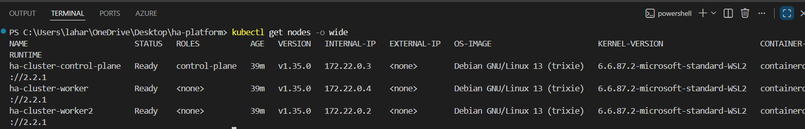

### 2. All Pods Running
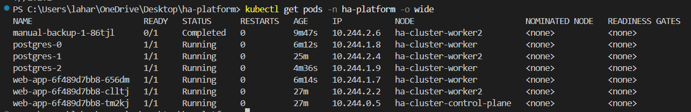

### 3. Streaming Replication (Before Drain)
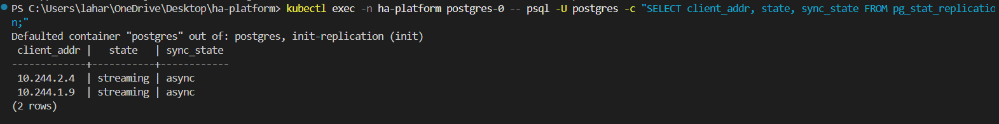

### 4. Anti-Affinity — Web App Pods on Different Nodes
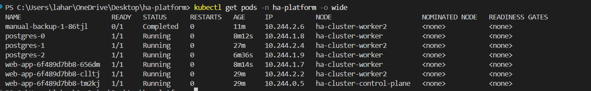

### 5. PodDisruptionBudgets
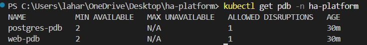

### 6. PVCs All Bound
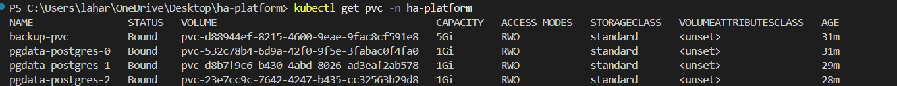

### 7. Backup CronJob
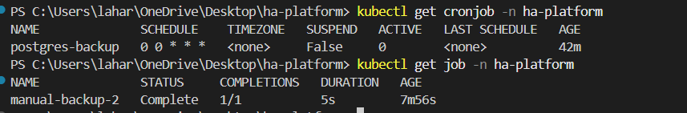

### 8. Backup File on PVC
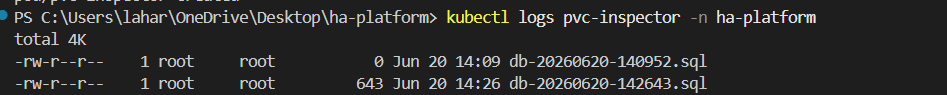

### 9. Web App Response
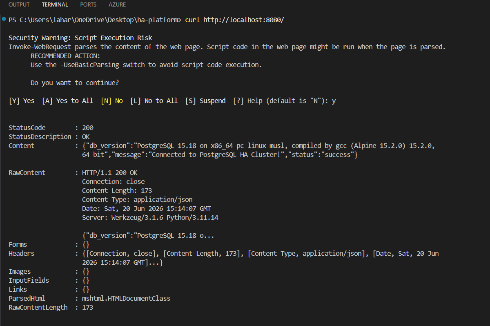

### 10. Drain — PDB Blocking Unsafe Eviction
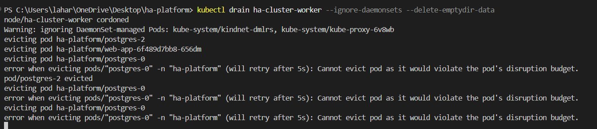

### 11. Pods Recovered After Drain
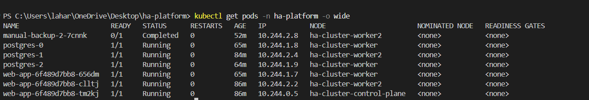

### 12. Streaming Replication (After Drain)
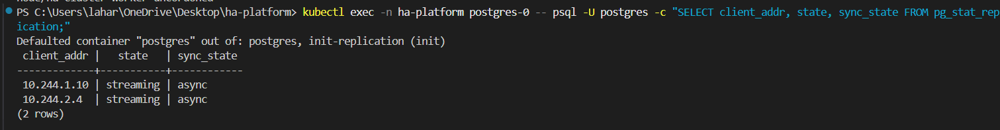

### 13. NetworkPolicy
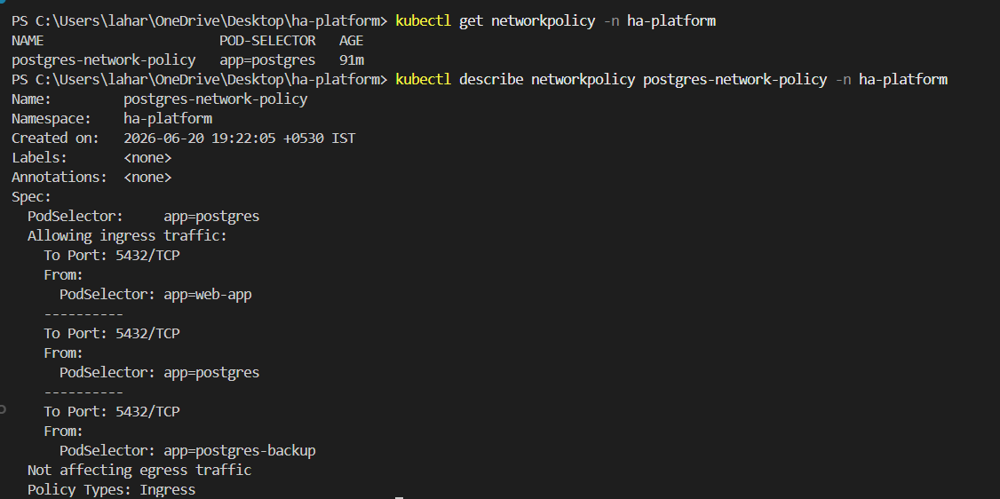

---

## Screenshot Summary

| # | File | What it shows |
|---|---|---|
| 1 | 1-cluster-nodes.png | 3-node kind cluster, all Ready |
| 2 | 2-all-pods-running.png | All 6 pods running across different nodes |
| 3 | 3-streaming-replication-initial.png | 2 standbys streaming before drain |
| 4 | 4-anti-affinity-proof.png | Web app pods spread across 3 nodes |
| 5 | 5-pdb-status.png | Both PDBs set to minAvailable: 2 |
| 6 | 6-pvcs-bound.png | All 4 PVCs bound and ready |
| 7 | 7-backup-cronjob.png | CronJob exists, manual run completed |
| 8 | 8-backup-file-on-pvc.png | Real .sql file saved to backup PVC |
| 9 | 9-web-app-response.png | App returns 200 and connects to DB |
| 10 | 10-drain-pdb-blocking.png | PDB blocked eviction to protect availability |
| 11 | 11-post-drain-recovery.png | All pods back up after drain |
| 12 | 12-replication-post-drain.png | Replication resumed after postgres-0 restarted |
| 13 | 13-networkpolicy.png | DB only accepts traffic from allowed pods |

---

## Author

**Lahari Sri**
Project: Architect Highly Available Stateful Platform on Kubernetes
