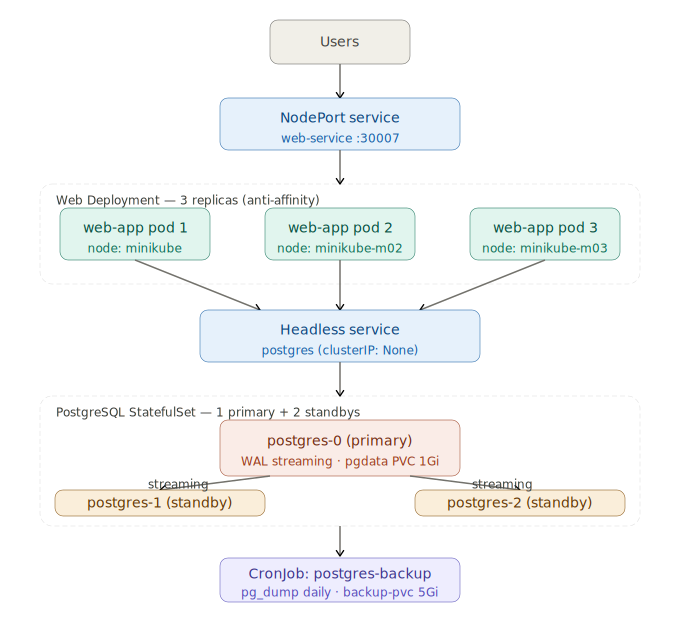

# Highly Available Stateful Platform on Kubernetes

## Project Overview

A production-grade HA platform deployed on Kubernetes featuring:

- Stateless Web Application (3 replicas with anti-affinity)
- PostgreSQL StatefulSet (1 Primary + 2 Standbys with streaming replication)
- Persistent Storage via PVCs (1Gi per replica)
- PodDisruptionBudgets (minAvailable: 2 for both web and DB)
- NetworkPolicy restricting database access to web-app pods, postgres replication peers, and the backup job only
- Zero-downtime Rolling Updates (maxSurge: 0, maxUnavailable: 1)
- Automated Daily Backups via CronJob to a dedicated 5Gi PVC

---

## Architecture Overview



---

## Prerequisites

- Docker Desktop (must be running before cluster creation)
- kind (`https://kind.sigs.k8s.io/docs/user/quick-start/#installation`)
- kubectl (`https://kubernetes.io/docs/tasks/tools/`)

Verify tools are installed:
```bash
kind version
kubectl version --client
docker version
```

---

## Project Structure

```
ha-platform/
├── Dockerfile
├── docker-compose.yml
├── requirements.txt
├── init-replication.sh
├── pvc-inspector.yaml
├── kind-config.yaml
├── README.md
│
├── src/
│   └── app.py
│
└── k8s/
    ├── namespace.yaml
    ├── postgres-secret.yaml
    ├── postgres-configmap.yaml
    ├── postgres-headless-svc.yaml
    ├── postgres-statefulset.yaml
    ├── postgres-pdb.yaml
    ├── postgres-networkpolicy.yaml
    ├── backup-pvc.yaml
    ├── backup-cronjob.yaml
    ├── web-deployment.yaml
    ├── web-service.yaml
    └── web-pdb.yaml
```

---

## Step-by-Step Deployment

### Step 1 — Create a 3-node kind cluster

Save the following to `kind-config.yaml`:
```yaml
kind: Cluster
apiVersion: kind.x-k8s.io/v1alpha4
nodes:
  - role: control-plane
  - role: worker
  - role: worker
```

Then create the cluster:
```bash
kind create cluster --name ha-cluster --config kind-config.yaml
kubectl config use-context kind-ha-cluster
kubectl get nodes
```

> **Local testing note:** kind's control-plane node carries a `NoSchedule` taint
> by default. With hard anti-affinity and only 2 worker nodes, the 3rd web-app
> replica cannot schedule until the taint is removed:
> ```bash
> kubectl taint nodes ha-cluster-control-plane node-role.kubernetes.io/control-plane:NoSchedule-
> ```
> In production this would be a dedicated 3-worker-node cluster.

> **NetworkPolicy note:** `postgres-networkpolicy.yaml` only enforces if your CNI
> supports NetworkPolicies. Plain kind (kindnet) does not. To enforce, use Calico/Cilium
> or `minikube start --cni=calico`.

### Step 2 — Apply all manifests in order
```bash
kubectl apply -f k8s/namespace.yaml
kubectl apply -f k8s/postgres-secret.yaml
kubectl apply -f k8s/postgres-configmap.yaml
kubectl apply -f k8s/backup-pvc.yaml
kubectl apply -f k8s/postgres-headless-svc.yaml
kubectl apply -f k8s/web-service.yaml
kubectl apply -f k8s/postgres-statefulset.yaml
kubectl apply -f k8s/web-deployment.yaml
kubectl apply -f k8s/postgres-pdb.yaml
kubectl apply -f k8s/web-pdb.yaml
kubectl apply -f k8s/postgres-networkpolicy.yaml
kubectl apply -f k8s/backup-cronjob.yaml
```

### Step 3 — Watch pods come up
```bash
kubectl get pods -n ha-platform -w
```
Wait until all 6 pods show `1/1 Running`.

### Step 4 — Verify replication
```bash
kubectl exec -n ha-platform postgres-0 -- psql -U postgres -c \
  "SELECT client_addr, state, sync_state FROM pg_stat_replication;"
```
Expected: 2 rows with `state = streaming`.

### Step 5 — Access the web app
```bash
kubectl port-forward -n ha-platform svc/web-service 8080:80
curl http://localhost:8080/
curl http://localhost:8080/health
curl http://localhost:8080/ready
```

---

## Verification Commands

```bash
# All pods across nodes
kubectl get pods -n ha-platform -o wide

# PVCs (3 x 1Gi + 1 x 5Gi backup, all Bound)
kubectl get pvc -n ha-platform

# Services (headless + NodePort)
kubectl get svc -n ha-platform

# PodDisruptionBudgets
kubectl get pdb -n ha-platform

# Rolling update strategy
kubectl get deployment web-app -n ha-platform -o jsonpath='{.spec.strategy}'

# NetworkPolicy
kubectl get networkpolicy -n ha-platform
kubectl describe networkpolicy postgres-network-policy -n ha-platform

# CronJob
kubectl get cronjob -n ha-platform

# Replication status
kubectl exec -n ha-platform postgres-0 -- psql -U postgres -c \
  "SELECT client_addr, state, sync_state FROM pg_stat_replication;"
```

---

## Resilience Testing (Node Drain)

```bash
# Check pod placement
kubectl get pods -n ha-platform -o wide

# Drain a worker node
kubectl drain ha-cluster-worker --ignore-daemonsets --delete-emptydir-data

# Watch pods reschedule
kubectl get pods -n ha-platform -o wide -w

# Verify replication resumed
kubectl exec -n ha-platform postgres-0 -- psql -U postgres -c \
  "SELECT client_addr, state, sync_state FROM pg_stat_replication;"

# Restore the node
kubectl uncordon ha-cluster-worker
```

**Expected:** PodDisruptionBudget blocks unsafe eviction until postgres-0 reschedules
and becomes Ready — keeping at least 2 postgres replicas running at all times.
Replication resumes automatically. Web app maintains 2/3 pods serving traffic throughout.

---

## Manual Backup Test

```bash
kubectl create job --from=cronjob/postgres-backup manual-backup-test -n ha-platform
kubectl logs -n ha-platform job/manual-backup-test
kubectl apply -f pvc-inspector.yaml
kubectl logs pvc-inspector -n ha-platform
kubectl delete pod pvc-inspector -n ha-platform
```

---

## Docker Compose (Automated Logic Verification)

```bash
docker-compose up --build
curl http://localhost:8080/
curl http://localhost:8080/health
curl http://localhost:8080/ready
docker-compose down
```

Expected responses:
- `/` → `{"status":"success","message":"Connected to PostgreSQL HA Cluster!",...}`
- `/health` → `{"status":"healthy"}`
- `/ready` → `{"status":"ready"}`

---

## Evidence of Resilience

### 1. Cluster Nodes


### 2. All Pods Running (Pre-Drain)


### 3. Streaming Replication (Pre-Drain)


### 4. Anti-Affinity — Pods on Different Nodes


### 5. PodDisruptionBudgets


### 6. PVCs Bound


### 7. Backup CronJob


### 8. Backup File on PVC


### 9. Web App Response


### 10. Node Drain — PDB Blocking Unsafe Eviction


### 11. Post-Drain Pod Recovery


### 12. Streaming Replication (Post-Drain)


### 13. NetworkPolicy


---

## Verification Screenshots Summary

| # | Filename | What it proves |
|---|---|---|
| 1 | cluster-nodes.png | 3-node kind cluster, all Ready |
| 2 | all-pods-running.png | All 6 pods 1/1 Running across nodes |
| 3 | streaming-replication-initial.png | 2 streaming standbys before drain |
| 4 | anti-affinity-proof.png | web-app pods on 3 different nodes |
| 5 | pdb-status.png | Both PDBs minAvailable: 2 |
| 6 | pvcs-bound.png | All 4 PVCs Bound |
| 7 | backup-cronjob.png | CronJob defined, manual run Complete |
| 8 | backup-file-on-pvc.png | 643-byte .sql file on backup PVC |
| 9 | web-app-response.png | StatusCode 200, DB connected |
| 10 | drain-pdb-blocking.png | PDB blocking unsafe eviction |
| 11 | post-drain-recovery.png | All pods recovered after drain |
| 12 | replication-post-drain.png | 2 rows streaming after drain |
| 13 | networkpolicy.png | DB access restricted to web-app, replication peers, backup job |

---

## Author

Name: Lahari Sri
Project: Architect Highly Available Stateful Platform on Kubernetes