# 🚀 Highly Available Web Platform on Kubernetes

---

### 📌 Overview

This project demonstrates a production-ready, highly available web application deployed on Kubernetes with a stateful PostgreSQL database, resilience testing, health probes, and persistent storage.

The platform is designed to:
- Automatically recover from pod and node failures
- Maintain data persistence using Persistent Volume Claims (PVCs)
- Ensure zero-downtime deployments
- Protect availability using PodDisruptionBudgets (PDBs)

---

### 🏗 Architecture

#### High-Level Architecture Diagram

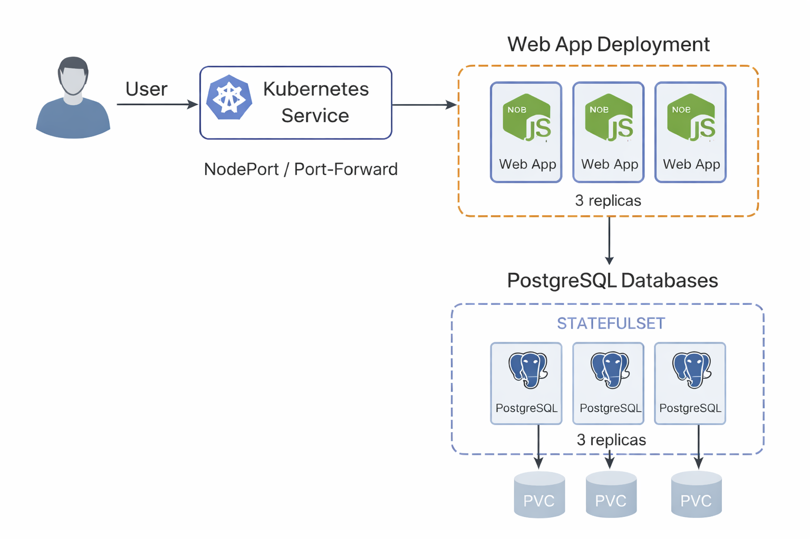

---

#### Architecture Flow

User
|
|--> Kubernetes Service (NodePort / Port-Forward)
|
|--> Web Application Deployment (3 replicas - Node.js)
|
|--> PostgreSQL StatefulSet (3 replicas)
|
|--> Persistent Volume Claims (PVCs)


---

#### Architecture Components

- Kubernetes Service exposes the web application
- Web Application runs as a Deployment with 3 replicas
- PostgreSQL runs as a StatefulSet with persistent storage
- PVCs ensure data durability across restarts
- PodDisruptionBudgets ensure minimum availability

---

### 🛠 Prerequisites

Ensure the following tools are installed:

- Docker
- Docker Compose
- kubectl
- Minikube (Docker driver)
- Git
- Windows / Linux / macOS

---

### 🐳 Application Logic Verification (Docker)

The application is validated using Docker Compose before Kubernetes deployment.

```bash
docker-compose down
docker-compose up --build


Verify application response:

curl http://localhost:3000


Expected output:

Web App is running 🚀


This confirms:

Application builds successfully

Database connectivity works

API is reachable

☸️ Kubernetes Deployment

Start Minikube:

minikube start


Verify node status:

kubectl get nodes


Apply Kubernetes manifests:

kubectl apply -f k8s/


Set namespace context:

kubectl config set-context --current --namespace=ha-platform


Verify pods:

kubectl get pods

🗄 Database Configuration (StatefulSet)

PostgreSQL runs as a StatefulSet

Each replica has its own Persistent Volume

Headless service provides stable network identity

Data persists across pod restarts and node drain

Verify database resources:

kubectl get statefulsets
kubectl get pvc


All PVCs should be in Bound state.

🔐 Configuration & Secrets

ConfigMaps store non-sensitive configuration

Secrets store database credentials

No credentials are hardcoded in manifests or source code

Verify:

kubectl get configmaps
kubectl get secrets

🩺 Health Checks

The web application uses HTTP-based probes.

Liveness Probe

Endpoint: /health

Restarts container if unhealthy

Readiness Probe

Endpoint: /ready

Prevents traffic to unready pods

Verify probes:

kubectl describe deployment web-app

🔄 Rolling Updates & High Availability

Deployment uses RollingUpdate strategy

3 replicas ensure high availability

Pod Anti-Affinity distributes pods

PodDisruptionBudgets protect minimum replicas

🌐 Service Access

The application is exposed using a Kubernetes Service.

Due to Minikube Docker driver limitations on Windows, access is verified using port-forwarding:

kubectl port-forward svc/web-service 3000:3000


Verify access:

curl http://localhost:3000

🔁 Resilience & Self-Healing Test (Node Drain)

Drain the node:

kubectl drain minikube --ignore-daemonsets --force


During drain:

Application and database pods are evicted

Kubernetes recreates pods automatically

PodDisruptionBudgets prevent unsafe evictions

Watch recovery:

kubectl get pods -w


Restore node:

kubectl uncordon minikube

✅ Final Health Verification

Verify system stability:

kubectl get pods
kubectl get pvc


Results:

All pods return to Running and Ready state

All PVCs remain Bound

Database storage is preserved

🏁 Conclusion

This project successfully demonstrates:

Kubernetes high availability

Stateful workloads with persistent storage

Automated recovery from node failures

Production-grade health checks and deployment strategies

The platform meets all core requirements and is fully resilient.

📸 Evidence

---

### 📸 Evidence & Screenshots

| Step | Description | Screenshot |
|-----|-------------|------------|
| 1 | Docker Compose running | 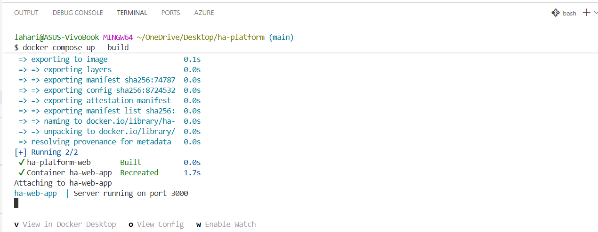 |
| 2 | Docker app response | 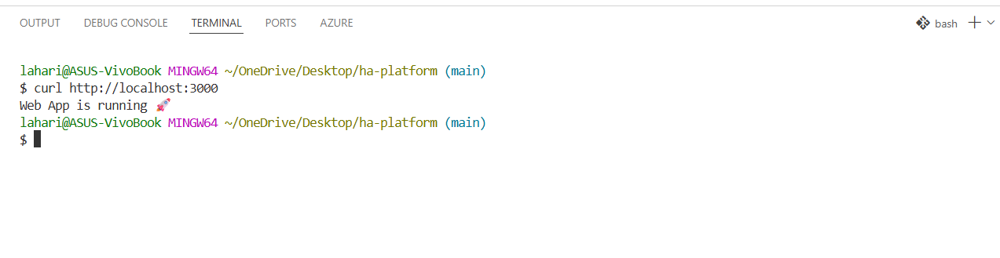 |
| 3 | Kubernetes pods running | 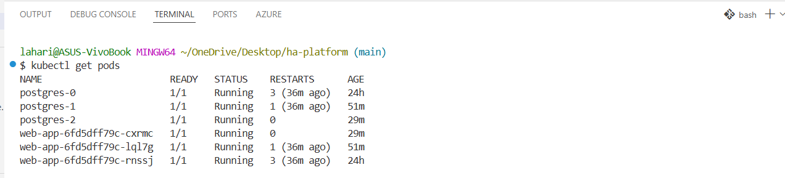 |
| 4 | StatefulSet and PVCs | 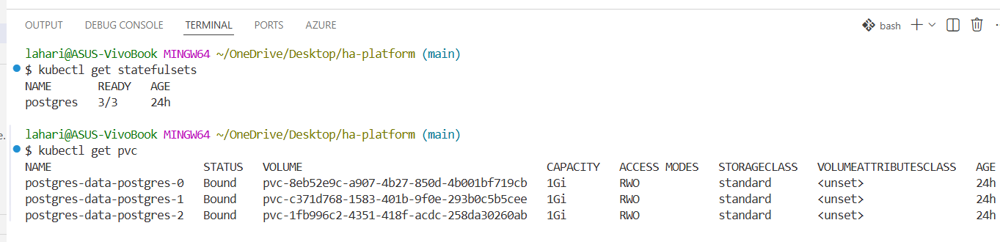 |
| 5 | Liveness and Readiness probes | 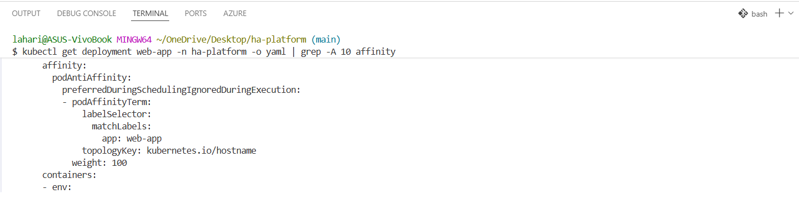 |
| 6 | Kubernetes service access | 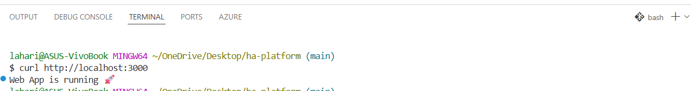 |
| 7 | Node drain command | 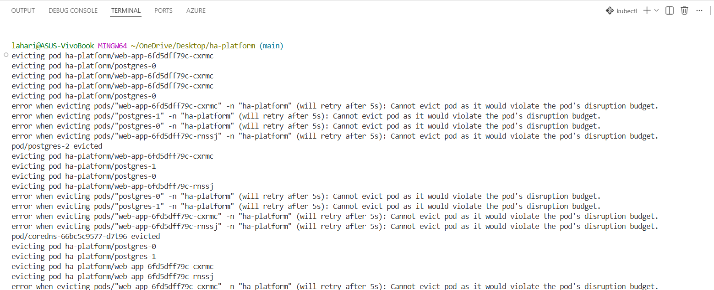 |
| 8 | Pod recreation after drain | 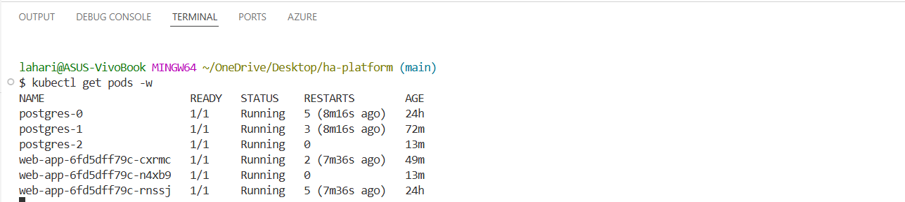 |
| 9 | Final pod state | 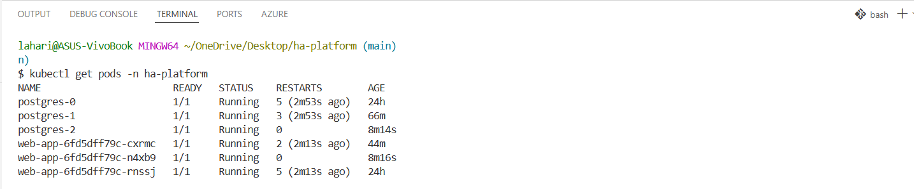 |
|10 | PVC persistence | 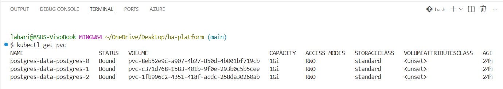 |
